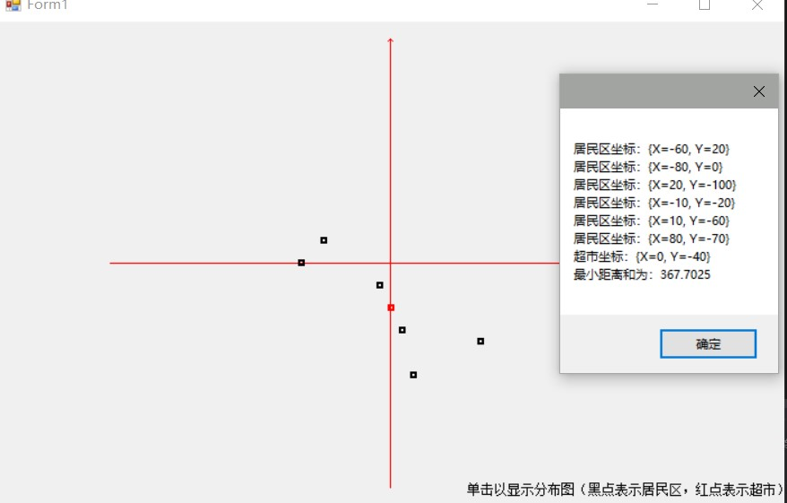

## 实验三  超市选址问题 ##
### 实验内容： ###
在一个按照东西和南北方向划分成规整街区的城市里，n个居民点散乱地分布在不同的街区中。用x坐标表示东西向，用y坐标表示南北向。各居民点的位置可以由坐标(x,y)表示。街区中任意两点(x1,y1)和(x2,y2)之间的距离可以用数值|x1-x2|+|y1-y2|度量。居民们希望在城市中选择建立超市的最佳位置，使n个居民点到超市的距离总和最小。
编程任务：给定n个居民点的位置，编程计算n个居民点到超市的距离总和的最小值。
输入：输入由多组测试数据组成。每组测试数据输入的第1行是居民点数n，接下来n行是居民点的位置，每行两个整数x和y。
输出：对应每组输入，输出数据是n个居民点到超市距离总和的最小值。
输入示例：5              居民点到超市最小距离和：10
1  2 
2  2 
1  3        
3  -2
3  3
### 实验要求: ###
本实验需完成算法设计、数据结构的选择、运行结果分析以及相关内容的说明等。例如，求中位数的过程可用快速排序等算法将n个居民点的x和y坐标分别排序后，计算出中位数。程序的编写可以参考以下步骤：
1. 输入居民点位置文件，或用随机数发生器得到各居民点位置坐标(x,y)。
2. 将输入的二维数组(x,y)转化为两个一维数组(x)、(y)。
3. 计算横坐标和纵坐标数组的中位数。
4. 求n个居民点到超市距离总和的最小值，并输出此值，并以图示的方式显示居民点与超市的位置分布。
### 结果截图: ###

