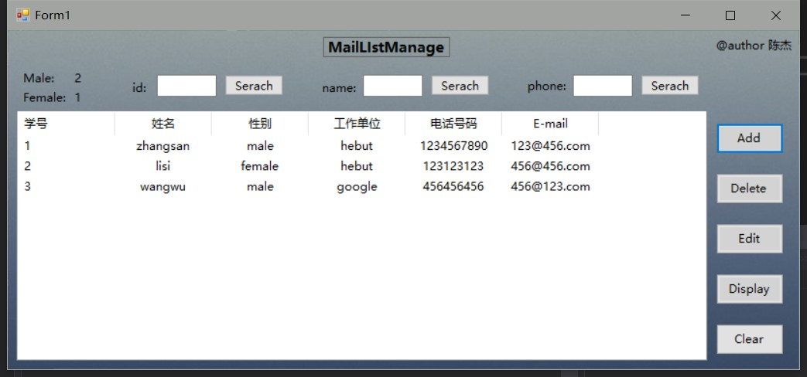

## 实验二  通讯录管理程序设计与实现 ##
### 实验要求： ###
1. 熟悉可视化编程语言的程序设计方法(不限编程工具可使用Visual Studio、Java等)。
2. 运用面向对象知识对实验题目进行分析和设计。
3. 进行程序编写和调试工作。
### 实验内容 ###
 设计、实现一个具有通讯信息插入、修改、删除、显示、查询和统计功能的通讯录管理程序。程序设计功能及要求：

1. 人数不定，数据使用文件存放。
2. 记录每位同学的学号、姓名、性别、工作单位、电话号码和E-mail地址建立单独的条目，存入数据文件。
3. 可对记录中的姓名和电话号码等进行修改。
4. 可增加或删除记录。
5. 可显示所有保存的记录。
6. 可以统计男女同学或总人数。
7. 通过姓名、学号或电话号码查询到同学的条目。
8. 在开始画面加入简单的菜单便于选择功能。
9. 储存数据文件格式：
        学号  姓名  性别  工作单位    电话号码    E-mail 
        1       李四  …. …. …. 
### 结果截图 ###
